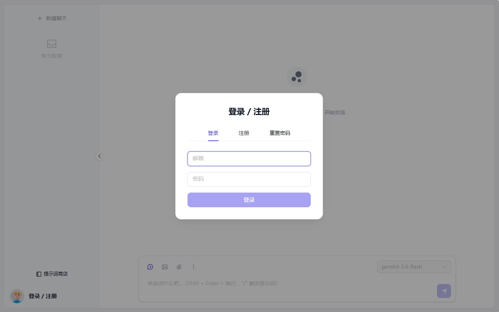
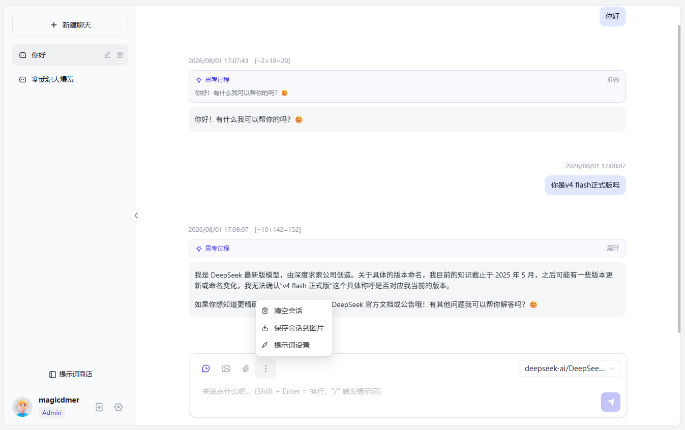
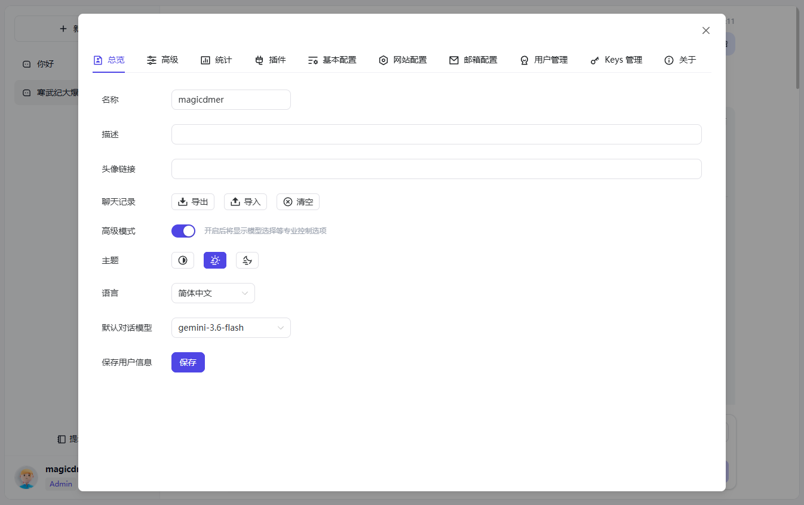

# EasyChat

[中文](./README.md) | [English](./README.en.md)

EasyChat is a self-hosted, multi-model AI chat application with Simplified Chinese as its default interface. It connects to different model providers through OpenAI-compatible APIs and includes conversation management, users and keys, multimodal chat, image generation, plugin tools, and usage analytics.

> EasyChat evolved from [chatgpt-web-dev/chatgpt-web](https://github.com/chatgpt-web-dev/chatgpt-web) and contains extensive independent enhancements. See [LICENSE](./LICENSE) for the applicable copyright and license notices.

## Features

- OpenAI-compatible APIs with custom base URLs and multiple providers
- Multiple conversations, streaming responses, context, and automatic titles
- Reasoning display, image uploads, multimodal chat, and historical image reuse
- Multiple API keys, model discovery, role permissions, and randomized key selection
- Registration, email verification, user management, and administrator settings
- Token, request, user, and model-distribution statistics
- Plugin runtime, function-call tools, and per-user plugin enablement
- Built-in image-generation plugin with an administrator-selected model
- Simplified Chinese, Traditional Chinese, and English interfaces
- Docker, Docker Compose, and PWA support

See the [architecture document](./docs/ARCHITECTURE.md) for implementation details.

## Screenshots

These screenshots are retained as feature references and will be replaced with the latest EasyChat interface.

### Login and chat




### Settings and administration




## Technology

- Frontend: Vue 3, Vite, TypeScript, Naive UI, and Pinia
- Backend: Node.js, Express, and TypeScript
- Storage: SQLite and IndexedDB
- Package manager: pnpm 9.15.9
- Runtime: Node.js 24.18.0

## Local development

### Prepare the environment

On Linux, [mise](https://mise.jdx.dev/) is recommended:

```bash
mise install
```

On Windows, use [fnm](https://github.com/Schniz/fnm) and Corepack:

```powershell
fnm use
corepack enable
corepack prepare pnpm@9.15.9 --activate
```

### Install dependencies

The frontend and backend use separate dependency directories:

```bash
pnpm install --frozen-lockfile
cd service
pnpm install --frozen-lockfile
```

### Configure the backend

Copy the backend environment example:

```bash
cd service
cp .env.example .env
```

Windows PowerShell:

```powershell
Copy-Item .env.example .env
```

Common environment variables:

| Variable | Purpose |
| --- | --- |
| `AUTH_SECRET_KEY` | Enables login and JWT authentication when non-empty |
| `ROOT_USER` | Initial administrator email |
| `REGISTER_ENABLED` | Enables registration |
| `OPENAI_API_KEY` | Optional initial OpenAI-compatible key |
| `OPENAI_API_BASE_URL` | Optional default OpenAI-compatible endpoint |
| `TITLE_MODEL` | Model used to generate a title after the first response |
| `MAX_REQUEST_PER_HOUR` | Hourly request limit |
| `SMTP_*` | Email verification and notification settings |
| `UPLOAD_*` | Upload size, cleanup interval, and retention |
| `PLUGIN_DIR` | External plugin directory |

See [service/.env.example](./service/.env.example) for the complete list. API keys, allowed models, and most site settings can also be managed in the administrator interface.

### Start development servers

Terminal one, start the backend at `http://127.0.0.1:3002`:

```bash
cd service
pnpm start
```

Terminal two, start the frontend at `http://127.0.0.1:10002`:

```bash
pnpm dev
```

## Build and verification

Run the complete frontend checks and production build:

```bash
pnpm build
```

Build the backend:

```bash
cd service
pnpm build
```

## Docker deployment

### Local image

```bash
docker build -t easychat:1.0.4 .
docker run -d \
  --name easychat \
  -p 3002:3002 \
  -v easychat-data:/app/data \
  -v easychat-uploads:/app/uploads \
  -e AUTH_SECRET_KEY=replace-with-a-random-secret \
  easychat:1.0.4
```

Open `http://localhost:3002`.

### Docker Compose

Copy [docker-compose/docker-compose.yml](./docker-compose/docker-compose.yml) into a standalone deployment directory, edit the administrator email and secret, and create a sibling `plugins/` directory. The image includes the image-generation plugin, while Compose mounts that directory as a separate read-only external plugin directory without hiding bundled plugins:

```bash
docker-compose up -d
```

Publishing a GitHub Release pushes its version tag to `magicdmer/easychat`; a non-prerelease also updates `latest`. The manual test workflow only builds and smoke-tests a local Runner image and never pushes it.

## Project structure

```text
EasyChat/
├─ src/                 # Vue frontend
├─ service/             # Express backend, SQLite, and plugin host
├─ service/plugin-sdk/  # @easychat/plugin-sdk
├─ plugins/             # External plugins
├─ docker-compose/      # Compose and Nginx examples
└─ docs/                # Architecture and screenshots
```

## Contributing

Read the [contributing guide](./CONTRIBUTING.en.md) before submitting changes. Run the frontend `pnpm build` and backend `service/pnpm build` at minimum.

## License

EasyChat is licensed under the [MIT License](./LICENSE). The license file retains notices for code inherited from the upstream project.
